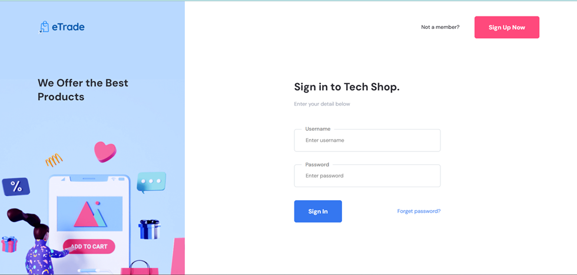
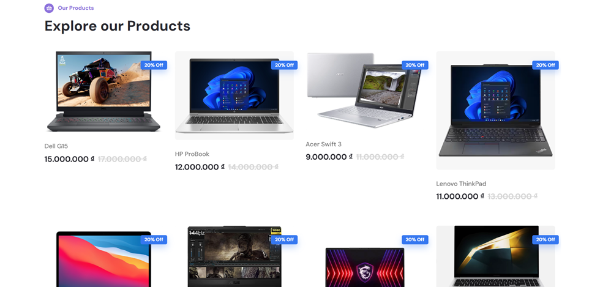
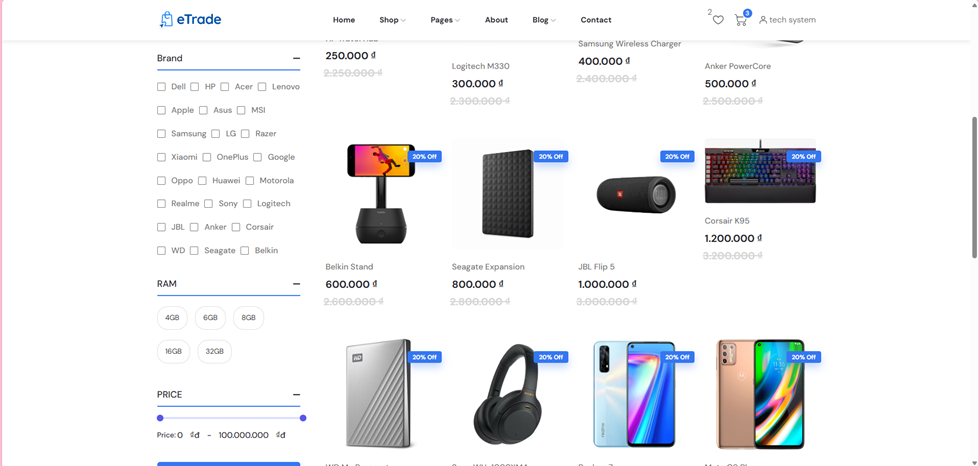
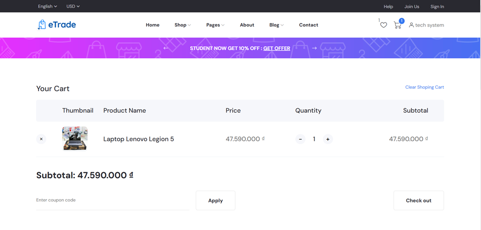
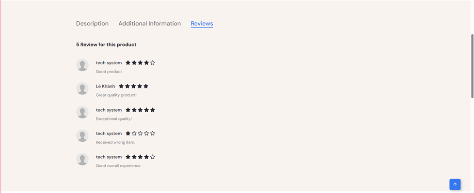

# Welcome to TechShopHCMUTE Website
# Project Overview

TechShopHCMUTE is a project developed with the goal of learning about sales processes through various stages, from the manager's steps in preparing to add products to inventory, to showcasing products on the website for users to view, favorite, add to their cart, and proceed through the complex payment processes. TechShopHCMUTE is not only a capstone project for the Web Programming course but also a passionate initiative driven by the spirit of curiosity, innovation, and self-challenge to continuously improve the product. This is also our team’s first project, so it might still have shortcomings. We sincerely welcome feedback from everyone to help us improve and learn even more.

## GUI of App
### Login at here

### Main Interface


### Preference searching 

### Shopping you prefer right here

### After purchasing the product, you can share your purchasing experience here


# Table of Contents
- [Features](#features)
- [Project Architecture](#-project-architecture-spring-boot-with-thymeleaf)
- [Technologies Used](#technologies-used)
- [Prerequisites](#prerequisites)
- [Installation](#installation)
- [Configuration](#configuration)
- [Usage](#usage)
- [Contributing](#contributing)

## Features

### 1. Main Features
- Product Management: Display product lists, product details, and support keyword search, price filtering, brand, or features.
- Shopping Cart and Checkout: Users can add products to the cart, update quantities, and proceed with payment.
- Wishlist: Allows users to save their favorite products without requiring login.
- User Account Management: Registration, login, profile management, and password changes.
- Authorization: Manage access rights for admins and regular users.
### 2. Performance and User Experience
- Dynamic and User-friendly Interface: Using Thymeleaf combined with AJAX to create a smooth experience, reducing page reload times during interactions.
- Fast Response: Search and filtering features implemented with AJAX help users find products quickly.
- Responsive Design: Optimized for both large screens (desktop) and small screens (mobile devices).
### 3. Security
- Authentication and Authorization: Using Spring Security to protect personal data and manage access rights.
- Password Encryption: Enhance user information security by encrypting passwords.

## 📚 Project Architecture: Spring Boot with Thymeleaf

## 🔍 Overview
This project leverages **Spring Boot** as the backend framework and **Thymeleaf** as the frontend templating engine to build a robust web application. It follows a layered architecture to ensure scalability, maintainability, and modular design.
📦We implemented the project using a three-tier architecture.

## 🏗️ Architecture Layers

### 1. **Presentation Layer (Frontend)**
- **Description**: Handles user interactions and displays dynamic web pages.
- **Tools & Technologies**: Thymeleaf, HTML5, CSS3, JavaScript, Bootstrap.
- **Responsibilities**:
  - Display data retrieved from the backend using Thymeleaf templates.
  - Validate user inputs using both client-side (JavaScript) and server-side validations.
  - Communicate with the backend via HTTP requests (AJAX for dynamic updates).

### 2. **Business Logic Layer (Service Layer)**
- **Description**: Contains the core business logic of the application.
- **Key Classes**: Services (`@Service` annotated classes).
- **Responsibilities**:
  - Implements the business rules and operations.
  - Calls the appropriate repositories for data manipulation.
  - Performs validations and data transformations before sending results to the controller.

### 3. **Data Access Layer**
- **Description**: Manages interactions with the database with some RDBMS such as MySQL/PostgreSQL (or any supported RDBMS).
- **Key Components**: Spring Data JPA, Repositories (`@Repository`).
- **Responsibilities**:
  - Define repository interfaces for CRUD operations.
  - Handle complex queries using JPA or custom `@Query` annotations.
  - Ensure data integrity and consistency.


## Technologies Used

- **Spring Boot**: A framework for building Java-based web applications.
- **Spring Security**: A powerful and customizable authentication and access-control framework for Java applications.
- **Bootstrap**: A front-end framework for developing responsive and mobile-first websites.
- **Thymeleaf**: A modern server-side Java template engine for web and standalone environments.
- **Hibernate**: An object-relational mapping (ORM) tool for Java.
- **MySQL**: A relational database management system.
- **Maven**: A build automation tool used primarily for Java projects.
- **GitHub**: A web-based platform for version control and collaboration, allowing multiple people to work on projects simultaneously.
- **AJAX**: A technique for creating asynchronous web applications, allowing web pages to be updated asynchronously by exchanging small amounts of data with the server behind the scenes.

## Prerequisites

### Make sure you have the following installed:

- Java Development Kit (JDK) - Prefer JDK 17 or higher. 
- SQLServer/MySQL/PostgreSQL Database.
- IDE (Eclipse, IntelliJ, etc.) - Our project is Spring Boot so prefer IntelliJ IDE.
- Git and GitHub Account.

## Installation
1. Clone the repository:
`git clone https://github.com/Hieu-with-love/tech-shop-hcmute.git`
2. Open the project with your preferred IDE
3. Configuration the database connection in `src\main\resources\application.yml`
4. Modify the package name according to your project. If the libraries I used are outdated, you can replace them with newer or alternative libraries.
5. Run your project. Wish you success!
## Configuration

1. Configuration the database connection in `src\main\resources\application.yml`
  - Ex: 
    ```
      datasource:
        url: jdbc:mysql://localhost:3306/tech_shop?useSSL=false&allowPublicKeyRetrieval=true&serverTimezone=UTC
        username: root
        password: 1234
    ```
    - You can update the database name to "tech_shop" as per your preference and modify the code according to your database. If not, you can copy the database name and create it with the same name as my existing configuration. 
    If you are using MySQL, you can use the following syntax: `CREATE DATABASE tech_shop;`
    - Also, change the username and password according to your existing database configuration.
2. You can configure the security in the SecurityConfig file as per your requirements.
## Usage
1. Start your Tomcat server.

2. Access the application at `http://localhost:8080/user/home`.

3. Explore the furniture items, login, and enjoy a seamless shopping experience.

## Contributing


We welcome contributions from everyone! If you have ideas, suggestions, or improvements, please feel free to contribute to this project. Here’s how you can get started:

1. **Fork the Repository**: Click the "Fork" button at the top right of this page to create a copy of this repository on your GitHub account.

2. **Clone the Repository**: Use `git clone` to clone the forked repository to your local machine.
    ```sh
    https://github.com/Hieu-with-love/tech-shop-hcmute.git
    ```

3. **Create a Branch**: Create a new branch for your feature or bug fix.
    ```sh
    git checkout -b feature-name
    ```

4. **Make Changes**: Make your changes in the new branch.

5. **Commit Changes**: Commit your changes with a descriptive commit message.
    ```sh
    git commit -m "Description of the feature or fix"
    ```

6. **Push to GitHub**: Push your changes to your forked repository.
    ```sh
    git push origin feature-name
    ```

7. **Create a Pull Request**: Go to the original repository and create a pull request from your forked repository. Provide a clear description of your changes and why they should be merged.

We appreciate your contributions and look forward to working together to improve TechShopHCMUTE!
